
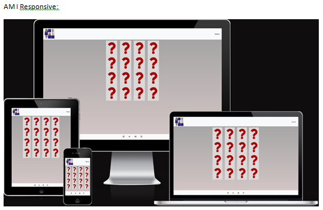

# Memory Game

The game is about uncovering faces of famous actors hidden under a question mark.  The user will uncover two images, by clicking on
each, and if reveal the hidden images.  If the images belong to the same actor, then they will remain unhidden.  If the images do not
belong to the same actor, they will be covered again and the user will have to make another guess and reveal other covered images.
The process continues until all images are matched correctly.  At this time, the user will be offered another chance to play the
game again.  If the user chooses to play again, images are shuffeled and the process of choosing matching images is repeated.
If the user chooses not to play again, the game stops and all matched images remain uncovered.

# Table of Contents 

* [Design](#design)

    * Technologies Used 
    * Frameworks, Libraries, Programs Used

* [User Experience](#user-experience)

    * Features

        * Current Features
        * Future Enhancements

* [User Stories](#user-stories)

* [Testing](#testing)

    * HTML Validation
    * CSS Validation
    * JS Validation
    * Manual Testing
    * Functional Testing
    * Website Performance Test
    * Issues Encountered

* [Deployment](#deployment)

    * Github Pages
    * Local Clone

* [Credits and Acknowledgements](#credits-and-acknowledgements)

## Design Idea

Wireframes are created using Word software.  Font family used: Arial, Helvetica, sans-serif.
All content was written by the developer.
Design is broken into the following main sections:

	- Header
	- Introduction
	- Game area
	- Goodbye area
	- Footer

All above sections are included on one page and as such a minimal navbar is provided to return the user to the introduction
screen.  
On page load, below the header, the introduction area, is displayed.  
The introduction area provides a brief description of the game's objective.  Below the description, a carousel of images is
displayed that clearly demonstrates the aim of the game.  A Play button, is provided to enable the user to have a go at playing
the game.
Once the Play button is clicked, the introduction area is hidden, and the game area is presented to the user.  After matching
all hidden images, a message is presented to ask the user to play again.  If the answer is yes, then the images are shuffeled,
rearranged, and the new screen is presented to the user to continue with the game.  If the answer is no, the game area is hidden
and a short, Goodbye, message is presented to thank the user for playing.

### Design Wireframes

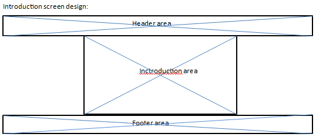

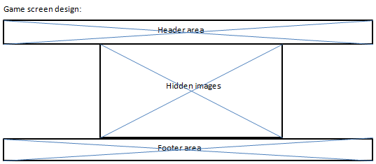

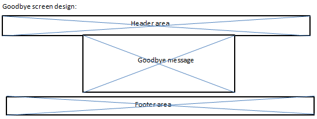

### Design Actual

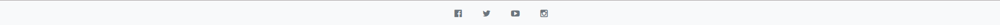

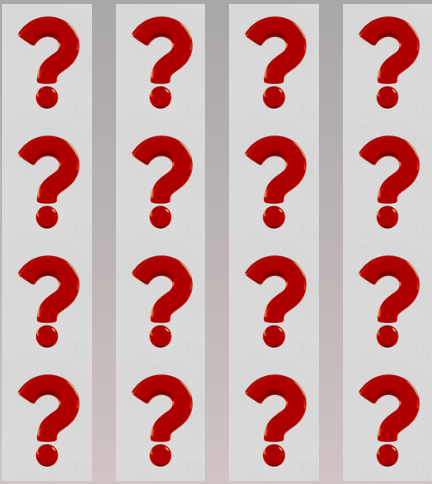

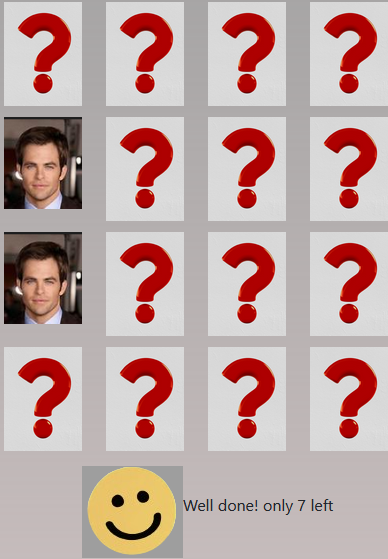

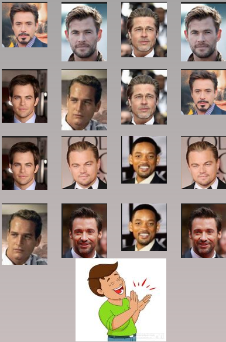

## Technologies Used

- HTML
- CSS
- Bootstrap
- Javascript

## Frameworks, Libraries, Programs Used

- Github
- Flexbox
- Fontawsome
- Am I Responsive
- Lighthouse
- W3C HTML/CSS validator
- W3C Markup validator
- Javascript validator

## Features

- simple, uncluttered, one page site
- no need to navigate between pages
- no need to scroll
- clear introduction
- intuitive game
- responsive on all device sizes

### Current Features

- navbar contains a single menu option to return the user to the introduction area
- introduction area describes the purpose of the game verbally, as well as visually
- a reaction is caused only when the designated areas are clicked
- a shake effect is caused when selected images do not match
- relevant emoji is displayed upon a successful/failed selection

### Future Features

- extend number, and type, of images
- add actual questions corresponding to specific images
- add different levels of complexity
- add a timer such that limits the user's selection time

## User Stories

## Testing

### Validation

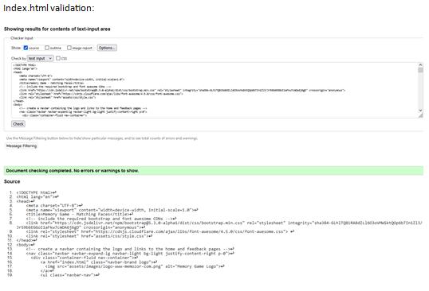

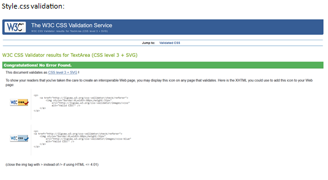

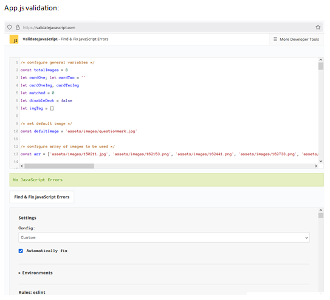

### Manual Testing

The website was tested manually, using MS Edge, Google Chrome, and Firefox.  All available device settings were tested one at a time by:
- Load pages on Firefox, MS Edge, Google Chrome
- Taking advantage of the development tool on the above platforms to test different viewports
- Accessing external social sites
- Testing the single menu option
