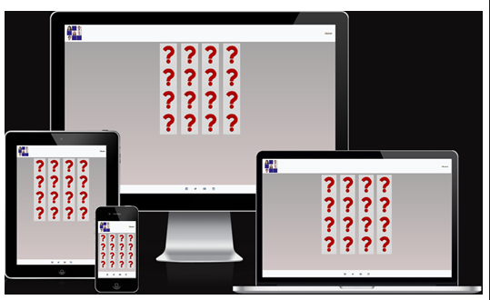
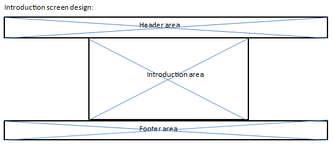

# Memory Game

The game is about uncovering faces of famous actors hidden under a question mark.  The user will uncover two images, by clicking on
each and reveal the hidden images.  If the images belong to the same actor, they will remain unhidden.  If the images do not
belong to the same actor, they will be covered again and the user will have to make another guess and reveal other covered images.
The process continues until all images are matched correctly.  At this time, the user will be offered another chance to play the
game again.  If the user chooses to play again, images are shuffled and the process of choosing matching images is repeated.
If the user chooses not to play again, the game stops and all matched images remain uncovered.

# Table of Contents 

* [Design](#design)

    * Technologies Used 
    * Frameworks, Libraries, Programs Used

* [User Stories](#user-stories)
  
* [Features](#features)
  
    * Current
    * Future

* [Testing](#testing)

    * HTML Validation
    * CSS Validation
    * JS Validation
    * Manual Testing
    * Functional Testing
    * Website Performance Test
    * Issues Encountered

* [Deployment](#deployment)

    * Github Pages
    * Local Clone

* [Credits and Acknowledgements](#credits-and-acknowledgements)

## Design Idea

Wireframes are created using the MS Word software.
All content was written by the developer.
Design is broken into the following main sections:

	- Header
	- Introduction area
	- Game area
	- Goodbye area
	- Footer

All above sections are included on one page, so a minimal navbar is provided to return the user to the introduction screen.  
On page load the introduction area, is displayed.  The introduction area provides a brief description of the game's objective.  
Below the description, a carousel of images is displayed that clearly demonstrates the aim of the game.  
A Play button, is provided to enable the user to have a go at playing the game.
Once the Play button is clicked, the introduction area is hidden, and the game area is presented to the user.  After matching
all hidden images, a message is presented to ask whether the user would like to play again.  If the answer is yes, the images 
are shuffled, rearranged, and the new screen is presented to the user to continue with the game.  If the answer is no, the game 
area is hidden and a short, Goodbye, message is presented to thank the user for playing.

### Design Wireframes

## Technologies Used

- HTML
- CSS
- Bootstrap
- Javascript
- JQuery

## Frameworks, Libraries, Programs Used

- Github
- Flexbox
- Fontawesome
- Am I Responsive
- Lighthouse
- W3C HTML/CSS validator
- W3C Markup validator
- Javascript validator

## User Stories

As a user I'd like to play an entertaining online game that:

1) has a clean and consistent interface
2) has clear instructions
3) has a demonstration section, ideally
4) behaves as indicated in the instructions
5) has a relatively short play time
6) has a feature to replay
7) has no adverse effect when clicking outside the game area unintentionally

User story result:

1) game area has a matrix of hidden images displayed clearly and consistently
2) welcome page provides clear instruction on the game's objectives
3) welcome page provides a demonstration of different stages of the game
4) two, and only two, images can be revealed for matching purposes; matched images stay uncovered and the rest will have to be matched
5) only 16 images are provided in order to keep the play time to a short period
6) once all images are matched, a message is displayed giving the user the opportunity to replay the game
7) clicking only on the Home menu option, covered images in the game area, and social sites' icons will result in an action

## Features

### Current Features

- simple, uncluttered, one page site
- no need to navigate between pages
- no need to scroll
- clear introduction
- intuitive game
- responsive on all device sizes
- navbar contains a single menu option to return the user to the introduction area
- introduction area describes the purpose of the game verbally, as well as visually
- a reaction is caused only when the designated areas are clicked
- a shake effect is caused when selected images do not match
- relevant emoji is displayed upon a successful/failed selection
- access to the four most popular social sites via the footer

### Future Features

- extend number, and type, of images
- add actual questions corresponding to specific images
- add different levels of complexity
- add a timer such that limits the user's selection/total time

## Testing

### Validation

### Manual Testing

The website was tested manually, using MS Edge, Google Chrome, and Firefox.  All available device settings were tested one at a time by:
- Load the page on Firefox, MS Edge, Google Chrome
- Taking advantage of the development tool on the above platforms to test different viewports
- Accessing external social sites provided on the footer
- Testing the single menu option

### Functional Testing

### Lighthouse Report

### Issues Encountered

Introduction, Game, and Goodbye areas where developed separately and when combined some CSS settings clashes occured. 
E.g. position, and sizing of elements. These were resolved using the inspect functionality of the browser's developer tool.
 
Logic bugs occured in the JS shuffleCards, changeImage, matchedFaces, and displayReaction functions which were resolved by using
the console.log functionality and addressing the cause.  E.g. list, arr, containing images to be used did not contain correct number of
entries resulting in some boxes not displaying any actor's image once clicked on.
 
The modal message, enabling replay of the game, loaded only once.  This issue was resolved by removing the fade keyword from the modal definition
in the index.html.
Another issue was preventing closure of the modal by clicking outside the box area which was resolved by using the data-bs-backdrop attribute and
having it set to static in the index.html; i.e. data-bs-backdrop='static'.
Final issue encountered with the modal, was having the screen locked, inaccessible, after closing the modal.  This was resolve by having the 
z-index attribute set to -1 in the CSS.

## Deployment

Github Pages

GitHub Pages used to deploy live version of the website.
1.	Log in to GitHub and locate GitHub Repository milestone-project
2.	At the top of the Repository(not the main navigation) locate "Settings" button on the menu.
3.	Scroll down the Settings page until you locate "GitHub Pages".
4.	Under "Source", click the dropdown menu "None" and select "Main" and click "Save".
5.	The page will automatically refresh.
6.	Scroll back to locate the now-published site link in the "GitHub Pages" section.

Forking the GitHub Repository

By forking the repository, we make a copy of the original repository on our GitHub account to view and change without affecting the original repository by using these steps:
1.	Log in to GitHub and locate GitHub Repository milestone-project 
2.	At the top of the Repository(under the main navigation) locate "Fork" button.
3.	Now you should have a copy of the original repository in your GitHub account.

Local Clone

1.	Log in to GitHub and locate GitHub Repository milestone-project
2.	Under the repository name click "Clone or download"
3.	Click on the code button, select clone with HTTPS, SSH or GitHub CLI and copy the link shown.
4.	Open Git Bash
5.	Change the current working directory to the location where you want the cloned directory to be made.
6.	Type git clone and then paste The URL copied in the step 3.
7.	Press Enter and your local clone will be created.

## Credits and Acknowledgements

Original idea for the game was from the https://www.codingnepalweb.com/build-memory-card-game-html-javascript site.
 
Navbar logo was from the www-memozor-com site.
 
Reaction emojis were from the clipart-library-com site.
 
Social sites' icons were from the FontAwesome site.
 
Thanks to my mentor, Mitko Bachvarov, for providing helpful suggestions, feedback, and links to different guides to assist with this project.
 
Thanks, also, to Miguel Ortega Logorreta, learning assistant, for the advice and guidance offered to assist with the project.
 
Code Institute for the educational materials.
